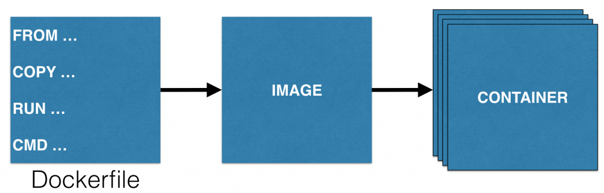
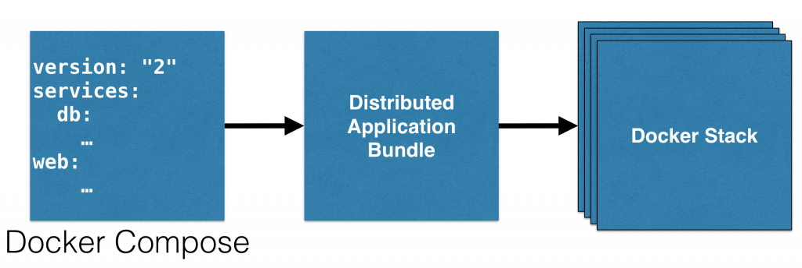

# Docker Services, Stack and Distributed Application Bundle

[Docker 1.12第一个Release版本](https://github.com/docker/docker/releases/tag/v1.12.0-rc1)已经发布超过[两周](https://blog.docker.com/2016/06/docker-1-12-built-in-orchestration/)了。（译者注：Docker 1.12.0发布日期是2016年6月20日）

这个blog将演示怎样用Docker Compose创建一个分布式应用群组包，并且在Docker Swarm模式下作为Docker Stack来发布。非常感谢[@friism](http://twitter.com/friism)帮助我理解这些概念。

我们先看一下功能：

* **内建编排功能**: 一个典型的应用使用Docker Compose文件来定义。这个定义包含了多个容器并发布到多个Host上。这样可以避免单点故障并且让应用可扩展。 很多编排框架（例如：Docker Swarm, Kubernetes和Mesos）可以让你来编排应用。 然而，这是一个应用非常重要的特性，现在Docker Engine有内建编排功能。本文的更多细节在后面的Blog中讨论。

* **服务**: 可以用`docker service create`命令来创建一个可以复制，分布式和负载均衡的服务。应用的“desired state”: 例如运行CouchBase3个容器，被提供，并且Docker engine保证足够的容器数量。如果一个容器故障，会启动另一个容器。如果一个节点故障，会在另一个节点上启动这个节点上的所有服务。更多的内容会在后面的Blog。

* **零配置安全**: Docker 1.12提供相互认证的TLS，为加入docker Swarm的每个节点直接通信提供认证、授权和加密。

* **Docker Stack和分布式应用群组包**: 分布式应用群组包，也叫DAB，是一个多服务分布式镜像格式。更多内容后面描述。

目前，你可以用`docker build`命令来用一个`Dockerfile`创建一个镜像。一个容器可以用`docker run`命令启动一个容器。可以方便地多次执行这个命令来创建多个容器。或者，你也可以通过使用Docker Compose文件，用`docker-compose scale`命令来扩展你的容器数量。



镜像是一个单独容器的可迁移格式。[分布式应用群组包](http://docker.com/dab)，也叫DAB，是在Docker 1.12中介绍的新概念，这是多个容器的可迁移格式。每个群组包可以在运行时发布成一个*Stack*。



更多关于DAB内容，请参考[docker.com/dab](http://docker.com/dab)。简单的，下面是一个类比图：

**Dockerfile -> Image -> Container**

**Docker Compose -> Distributed Application Bundle -> Docker Stack**

下面，我们来用一个Docker Compose文件创建一个DAB，并把它发布为一个Docker Stack。

需要重点前调，在Docker 1.12-RC2中这是一个实验功能。

## 用Docker Compose创建一个分布式应用群组包

Docker Compose命令行增加了一个新`bundle`命令。细节如下：

```bash
> docker-compose bundle --help
Generate a Docker bundle from the Compose file.

Local images will be pushed to a Docker registry, and remote images
will be pulled to fetch an image digest.

Usage: bundle [options]

Options:
    -o, --output PATH          Path to write the bundle file to.
                               Defaults to "<project name>.dsb".
```

现在，我们用Docker Compose定义来创建一个DAB。下面是我们的Docker Compose定义：

```yml
version: "2"
services:
  db:
    container_name: "db"
    image: arungupta/oreilly-couchbase:latest
    ports:
      - 8091:8091
      - 8092:8092 
      - 8093:8093 
      - 11210:11210
  web:
    image: arungupta/oreilly-wildfly:latest
    depends_on:
      - db
    environment:
      - COUCHBASE_URI=db
    ports:
      - 8080:8080
```

这个Compose文件启动一个Wildfly和Couchbase服务。在Wildfly服务中预发布了一个Java EE应用，该应用连接Couchbase服务，并且允许用REST API执行CRUD操作。这个文件的源代码在：[github.com/arun-gupta/oreilly-docker-book/blob/master/hello-javaee/docker-compose.yml](https://github.com/arun-gupta/oreilly-docker-book/blob/master/hello-javaee/docker-compose.yml)。用下面命令创建一个群组包：

```bash
> docker-compose bundle
WARNING: Unsupported key 'depends_on' in services.web - ignoring
WARNING: Unsupported key 'container_name' in services.db - ignoring
Wrote bundle to hellojavaee.dsb
```

`depends_on`只是在两个服务之间创建依赖关系，让他们按照指定顺序启动。这个只是保证Docker容器启动顺序，但是容器实际会需要一些时间来完成启动。所以，这个功能只能部分解决依赖问题。`container_name`为容器指定一个名称。由于一个指定的容器名会造成强耦合，导致无法扩展容器规模。所以，这里可以忽略这两个警告。这个命令创建一个Compose项目名（这是目录名）同名的文件。在我们这里，创建了一个`hellojavaee.dsb`。在RC3中，这个文件的扩展名变为`.dab`。生成的应用群组包如下：

```json
{
  "services": {
    "db": {
      "Image": "arungupta/oreilly-couchbase@sha256:f150fcb9fca5392075c96f1baffc7f893858ba763f3c05cf0908ef2613cbf34c", 
      "Networks": [
        "default"
      ], 
      "Ports": [
        {
          "Port": 8091, 
          "Protocol": "tcp"
        }, 
        {
          "Port": 8092, 
          "Protocol": "tcp"
        }, 
        {
          "Port": 8093, 
          "Protocol": "tcp"
        }, 
        {
          "Port": 11210, 
          "Protocol": "tcp"
        }
      ]
    }, 
    "web": {
      "Env": [
        "COUCHBASE_URI=db"
      ], 
      "Image": "arungupta/oreilly-wildfly@sha256:d567ade7bb82ba8f15a85df0c6d692d85c15ec5a78d8826dfba92756babcb914", 
      "Networks": [
        "default"
      ], 
      "Ports": [
        {
          "Port": 8080, 
          "Protocol": "tcp"
        }
      ]
    }
  }, 
  "version": "0.1"
}
```


